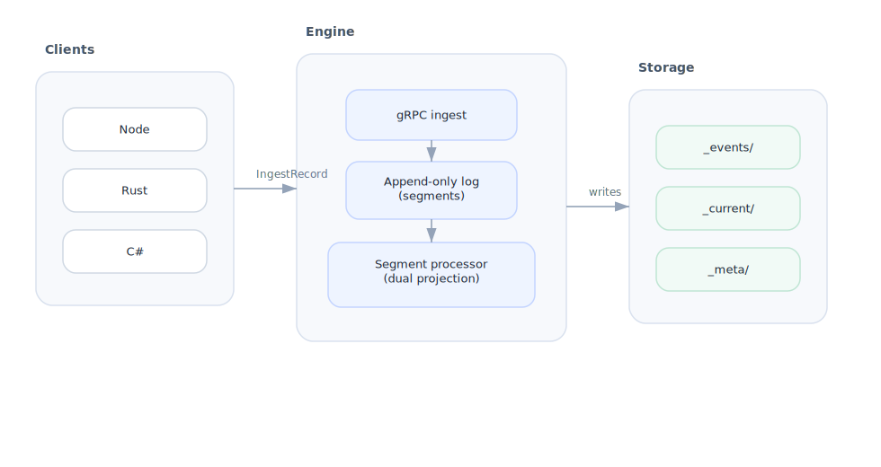

# Architecture

Reflog keeps ingest simple while producing analytics-ready Parquet outputs. Events are accepted over gRPC, written to an append-only log, and then projected into query-friendly tables.

The diagram shows how a single ingest path fans out into both historical and current-state views.

## Components

- **Ingest API (gRPC)**: accepts create/update/delete operations for your entities.
- **Segment storage**: persists events in append-only segment files for durability and replay.
- **Background processor**: reads closed segments, applies ordering/checkpoint logic, and builds projections.
- **Parquet projections**:
  - `_events`: full immutable event history.
  - `_current`: latest known state per entity key.
- **Query layer**: downstream tools query Parquet directly (DuckDB, Spark, Polars, warehouses).

## How to read the flow

1. **Write path first**: clients only need to send events to gRPC.
2. **Durability next**: every event lands in append-only segments before projection.
3. **Projection async**: processing happens in the background, so ingest stays lightweight.
4. **Two query shapes**: use `_events` for audit/time-travel, `_current` for latest-state workloads.
